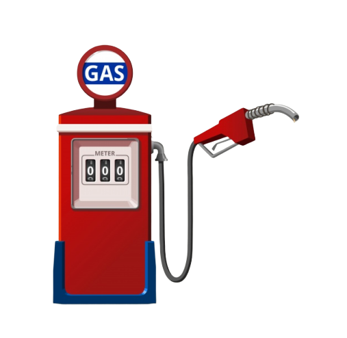

  <h1 align="center">
   
    
   
   
  MyFuel
  </h1>

  
 An application for fuel expense control 🚗⛽

## Features

A Node.js API built with Express and all the latest tools and best practices in development!

- ⚡ **Adonis** — A web framework for Node
- 💾 **Sequelize** — SQL dialect ORM for Node.js
- 🍂 **PostgreSQL** — document-based database
- 💖 **Lint** — ESlint/Prettier/Editor Config

## Dependencies

- [Node.js](https://nodejs.org/en/) 8.0.0 ou >
- [Yarn](https://yarnpkg.com/pt-BR/docs/install)
- [Docker](https://www.docker.com/)

## Prerequisites

To run this server you will need three containers running on your machine.

To do so, you will need to run the following commands:

- `docker run --name some-postgres -e POSTGRES_PASSWORD=docker -p 5433:5432 -d postgres`;

_Remember: If you restart your machine, you will need to start again the server with `docker start <container_id>`._

## Getting started

1. Clone this repo using `https://github.com/dudubernardino/MyFuel`
2. Run `yarn` to install dependencies. 
3. Copy the `.env.example` file and rename it to `.env`. 
4. Add all the values for the environment variables. 
5. Run `yarn start` to run the servers at `http://localhost:3333`.

## Docs

## Contributing

Please read [CONTRIBUTING.md](CONTRIBUTING.md) for details on our code of conduct, and the process for submitting pull requests.

## License

This project is licensed under the MIT License - see the [LICENSE.md](LICENSE.md) file for details.